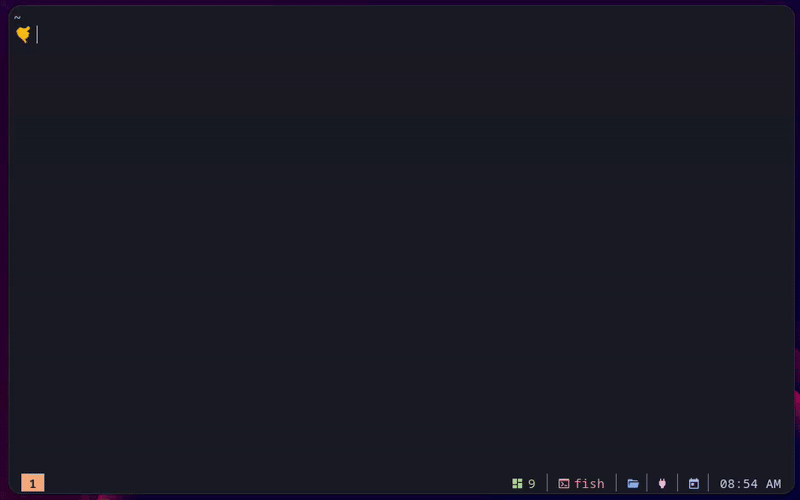

# gitsnip

> Download folders and files from any git repository, without cloning it.



[](https://github.com/dagimg-dot/gitsnip/releases/latest)
[](LICENSE)
[](https://github.com/dagimg-dot/gitsnip/releases)

```
$ gitsnip https://github.com/dagimg-dot/gitsnip/tree/main/internal/app
✓ dagimg-dot/gitsnip@main · internal/app → ./app   7 files · 12.2 KB · 1.4s
```

## Features

- Download a folder, a single file, several paths or glob patterns
- Paste links straight from the browser: GitHub, GitLab, Codeberg/Gitea, Bitbucket and sourcehut
- Works with any git host, including self-hosted servers and SSH remotes
- Fetches only what you ask for: a blob-less shallow clone never downloads the rest of the repository
- Uses the repository's default branch, or any branch, tag or commit you name
- Private repositories through SSH keys, git credential helpers, or `GH_TOKEN`/`GITHUB_TOKEN`
- Falls back to the GitHub API when git isn't installed
- Safe by default: never overwrites files without `--force` and never follows symlinks out of the repository
- Scriptable: `--json` output, quiet mode and meaningful exit codes

## Installation

### Using [eget](https://github.com/zyedidia/eget)

```bash
eget dagimg-dot/gitsnip
```

### Using Go

```bash
go install github.com/dagimg-dot/gitsnip/cmd/gitsnip@latest
```

### Manual installation

#### Linux/macOS

1. Download the binary for your platform from the [Releases page](https://github.com/dagimg-dot/gitsnip/releases).

2. Extract it:
```bash
tar -xzf gitsnip_<os>_<arch>.tar.gz
```

3. Move it to a directory in your `PATH`:
```bash
mv gitsnip $HOME/.local/bin/
```

4. Check the installation from a new terminal:
```bash
gitsnip --version
```

> Make sure `$HOME/.local/bin` is in your `PATH`. Add `export PATH="$HOME/.local/bin:$PATH"` to your shell's config file if it isn't.

#### Windows

1. Download `gitsnip_windows_amd64.zip` from the [Releases page](https://github.com/dagimg-dot/gitsnip/releases).

2. Extract it:
```powershell
Expand-Archive -Path gitsnip_windows_amd64.zip -DestinationPath C:\Program Files\gitsnip
```

3. Add `C:\Program Files\gitsnip` to your `PATH`, either through System Properties → Environment Variables, or from an elevated PowerShell:
```powershell
$oldPath = [Environment]::GetEnvironmentVariable('Path', 'Machine')
[Environment]::SetEnvironmentVariable('Path', $oldPath + ';C:\Program Files\gitsnip', 'Machine')
```

4. Check the installation from a new terminal:
```powershell
gitsnip --version
```

## Usage

```
gitsnip <source> [path...] [flags]
```

`<source>` names the repository, and optionally a branch and a path inside it. Every other argument is a path to download: a folder, a file, or a glob pattern (quote globs so your shell doesn't expand them).

### Sources

| You type | Meaning |
|---|---|
| `owner/repo` | a GitHub repository |
| `owner/repo@v1.2.0` | a branch, tag or commit of it |
| `owner/repo/docs` | a path inside it |
| `https://github.com/owner/repo/tree/main/docs` | a folder link copied from the browser |
| `https://github.com/owner/repo/blob/main/Makefile` | a file link |
| `https://gitlab.com/group/sub/project/-/tree/main/config` | GitLab, including nested groups |
| `https://codeberg.org/owner/repo/src/branch/main/docs` | Codeberg, Gitea and Forgejo |
| `git.sr.ht/~user/repo` | any host, written without the scheme |
| `git@github.com:owner/repo.git` | an SSH remote |
| `file:///path/to/repo.git` | a local repository |

Branch names that contain slashes, as in `.../tree/feature/login/src`, are resolved against the remote's real branches and tags.

### Examples

```bash
gitsnip dagimg-dot/gitsnip internal/app
gitsnip https://github.com/owner/repo/tree/main/docs
gitsnip owner/repo@v1.2.0 src/lib -o vendor/lib
gitsnip gitlab.com/group/project 'config/*.yml'
gitsnip git.sr.ht/~user/tools data/usage.txt 'data/*_linux.json'
gitsnip owner/repo
```

Where the files go:

- A folder is written into a folder of the same name: `src/components` becomes `./components`.
- A single file is written into the current directory.
- Several paths keep their structure below their common parent folder.
- The whole repository goes into a folder named after it.
- `-o` picks a different folder.

### Flags

```
-o, --output dir    where to write (default: the folder's name)
-b, --branch ref    branch, tag or commit (default: the repo's default)
-m, --method name   auto, sparse or api (default auto)
-t, --token token   access token (default: $GH_TOKEN or $GITHUB_TOKEN)
-f, --force         overwrite existing files
-q, --quiet         print nothing on success
-v, --verbose       show git commands and API calls
    --json          print the result as JSON
-h, --help          show this help
    --version       print the version
```

### Output

Progress and results go to stderr: a spinner on interactive terminals and one summary line when it's done. Errors say what went wrong and what to try next:

```
$ gitsnip torvalds/linux Documentation -b main
✗ Branch or tag "main" doesn't exist in torvalds/linux
  → the default branch is "master"; drop -b to use it

$ gitsnip dagimg-dot/gitsnip internal/ap
✗ Path "internal/ap" doesn't exist in dagimg-dot/gitsnip@main
  → did you mean internal/app?
```

Colors and animation only appear on a terminal. They are off when the output is piped, when `NO_COLOR` is set, or when `TERM=dumb`, and gitsnip switches to plain text if the terminal rejects them.

For scripts, `--json` prints the result to stdout:

```bash
$ gitsnip dagimg-dot/gitsnip internal/app --json
{"repo":"dagimg-dot/gitsnip","url":"https://github.com/dagimg-dot/gitsnip.git","ref":"main","commit":"49eab7956f7ef7b0c9a3425523657138f131a432","method":"sparse","paths":["internal/app"],"output":"/home/you/app","files":7,"bytes":12527,"ms":2858}
```

Exit codes: `0` success, `1` the download failed, `2` the command line was invalid, `130` interrupted.

## Download methods

| Method | How it works | Needs |
|---|---|---|
| `sparse` | Blob-less shallow clone plus a sparse checkout of just the requested paths | git |
| `api` | One GitHub API call lists the tree, then files download in parallel from raw.githubusercontent.com | github.com only |
| `auto` (default) | `sparse` when git is installed, otherwise `api` for GitHub | |

## Private repositories

- **SSH:** use an SSH source such as `git@github.com:owner/private.git`, and your SSH agent or keys are used.
- **Tokens:** set `GH_TOKEN` or `GITHUB_TOKEN`, or pass `--token`. Environment tokens are only sent to github.com. With the git method the token travels as an HTTP header, never inside the URL.
- **Credential helpers:** git uses any credential helper you have configured.

## Upgrading from v0.1

- The output folder is now set with `-o`. The old `gitsnip <url> <folder> <output>` form still works when the output starts with `./`, `../` or `/`, but prints a deprecation warning.
- `-b` now defaults to the repository's default branch instead of `main`.
- `--provider` is no longer needed. The host comes from the source.
- Existing files are no longer overwritten unless you pass `--force`.

## Troubleshooting

1. **Rate limit exceeded with `--method api`**: set `GITHUB_TOKEN` to raise GitHub's limit, or use the default git method, which has no API limits.
2. **Repository doesn't exist or is private**: check the name, then use an SSH source or set a token for private repositories.
3. **Anything else**: run the command again with `-v` to see the git commands and API calls behind the error.

## Contributing

Contributions are welcome. Run `make test` and `go vet ./...` before opening a pull request; CI runs the same checks.

## License

This project is licensed under the MIT License. See the [LICENSE](LICENSE) file for details.
